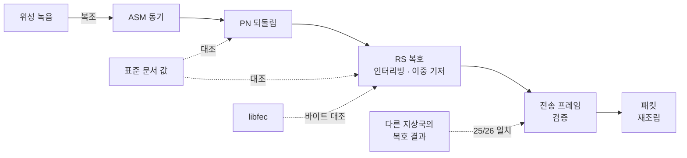
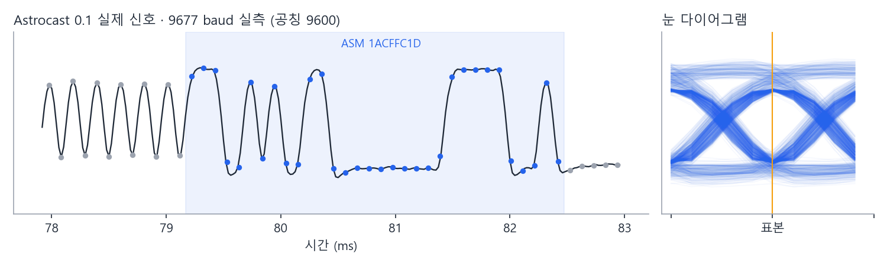
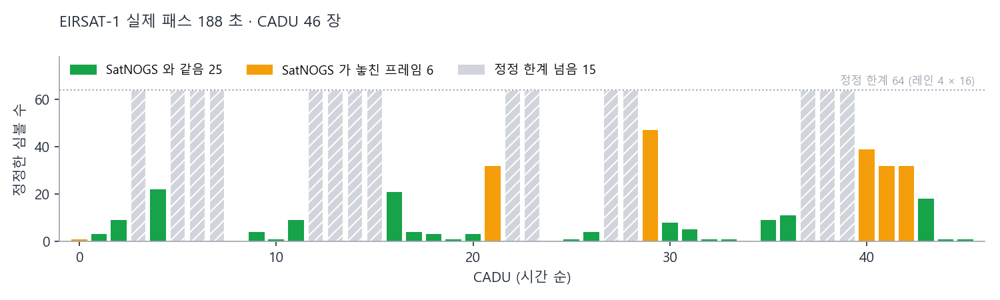
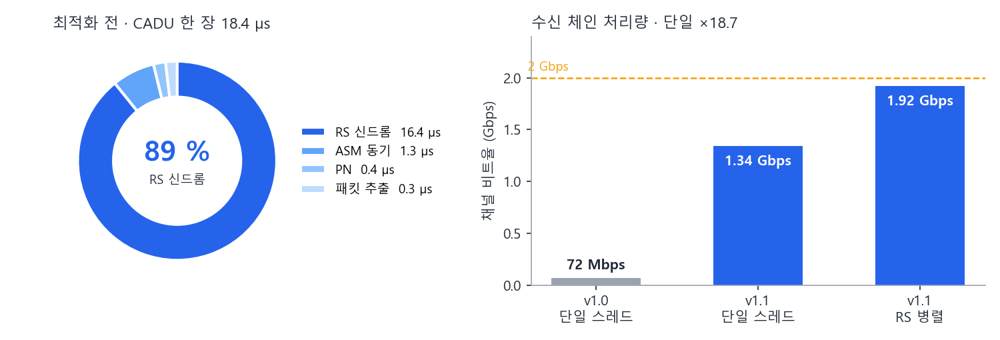

# 🛰️ SpaceLink

**CCSDS 다운링크 수신 처리기 · C# / .NET 10**
위성 비트열 → 전송 프레임 → 패킷 복원, 그리고 그 결과를 증명하는 신뢰성 시험

[](https://github.com/Haejyn/ccsds-downlink-reliability/actions/workflows/ci.yml)


---

## ✨ 하이라이트

| | |
|---|---|
| 📡 **실제 위성 신호 복호** | 위성 2기 녹음 · 패킷까지 복원 · 다른 지상국 결과와 **25/26 바이트 일치** |
| 🎯 **정답은 구현 밖에서** | CCSDS 표준 문서 값 · 공개 구현 libfec · 실제 위성 신호 |
| 🚀 **처리량 ×18.7** | 병목 측정(RS 신드롬 89 %) → SIMD · 단일 1.34 Gbps · 병렬 1.9 Gbps |
| 🧪 **시험의 검출력 측정** | 시험 139 · 커버리지 100 % · 뮤테이션 94.65 % · 요구사항 추적 30/30 |

> 핵심 계약: 손상 가능성이 있는 패킷은 내보내지 않음 · 손상과 무관한 패킷은 전부 복구

---

## 📡 수신 경로



---

## 🛰️ 실제 위성 신호

### Astrocast 0.1 · 깨끗한 신호



- CADU 3/3 복호 · **송신기가 계산한 프레임 CRC 일치**
- 첫 시도는 전부 RS 실패 → 원인: 심볼 속도 **9677 baud**(공칭 9600 대비 +0.8 %)
- 교훈: 동기 마커 검출 ≠ 복조 성공

### EIRSAT-1 · 잡음 섞인 실제 패스



- SatNOGS 지상국 녹음 188 초 · 9k6 GMSK · 인터리빙 4
- CADU 46장 중 **31장 복원 · 정정 심볼 323개**
- 그 지상국의 복호 결과와 **25/26 바이트 일치**
- 그 지상국이 놓친 **6장 추가 복원** · 근거: 프레임 카운트 빈자리 정확히 일치 · 패킷 88개 끊김 없이 조립

---

## 🎯 검증 방법

| 대상 | 정답의 출처 | 결과 |
|---|---|---|
| RS 생성 다항식 · 이중 기저 | CCSDS 131.0-B-5 부속서 G · F | 계수 32개 · 256값 왕복 일치 |
| PN 수열 (131071 · 255 비트) | 표준의 처음 40 비트 | 일치 · 첫 구현 오류 발견 |
| RS 부호화 · 복호 | libfec (고정 커밋 빌드) | 부호화 35/35 · 복호 25/25 |
| 정정 한계 | 체 이론으로 만든 오류 패턴 | 16개까지 정정 · 17개 이상 3,000/3,000 실패 선언 · 오정정 0 |
| 프레임 · 패킷 처리 | 결함 주입 모델 | 유실 · 비트 오류 · 중복 · 순서 뒤바뀜 → 출력 집합 정확히 일치 |
| 수신 체인 전체 | 실제 위성 신호 · 다른 지상국 결과 | Astrocast CRC 일치 · EIRSAT-1 25/26 |

---

## 🚀 성능



- 병목: RS 신드롬 계산 (시간의 89 %)
- 해결: 신드롬 32개 동시 계산 · PSHUFB 표 곱셈 (SSSE3)
- 결과: 단일 스레드 **×18.7** · RS 복호 병렬 **1.9 Gbps** (2 Gbps의 96 %)
- 함께 개선: 동기기 바이트 단위 읽기 · PN 벡터 XOR · 정정 경로 할당 2,007 → 1,066 B
- 신뢰성 유지: 최적화 후 뮤테이션 93.96 % 하락 → 실제 약점 2개 보강 · 증명 못 한 최적화 2개 되돌림
- CI 게이트: 시간 대신 **프레임당 할당**(러너 편차 회피)

---

## 🐞 발견하고 고친 결함

| ID | 결함 | 발견 경로 |
|---|---|---|
| C-1 | 256장 연속 유실 시 카운트 순환 → **손상 패킷 출력** | 결함 주입 시험 → 패킷 오류 제어(PEC)로 차단 |
| CH-4 | PN 수열이 표준과 다른 다항식 (주기 · 역원 성질은 통과) | 표준 문서 처음 40 비트 대조 |
| CH-5 | 짧은 프레임 뒤에 0 채움 전송 (표준: 앞쪽 가상 채움 · 미전송) | 표준 §4.3.7 대조 · CADU 259 → 164 B |
| 복조 | 실제 녹음 RS 전부 실패 | 심볼 속도 실측 9677 baud |
| 측정 | 처리량 20~25배 과소 측정 | 병렬 시험 부하 분리 · 전용 벤치마크 |

원인 · 수정 · 고정한 시험 → [시험 보고서](docs/test-report.md)

---

## 📊 수치

| 항목 | 값 |
|---|---|
| 시험 | 139 통과 · 빌드 경고 0 |
| 커버리지 | 라인 100 % (786/786) · 분기 99.7 % (329/330) |
| 뮤테이션 (Stryker.NET) | 94.65 % · 생존 전부 판정 · 실제 약점 1개 |
| 요구사항 추적 | 30/30 · `tools/trace.py` 자동 생성 |
| 처리량 (오류 없음) | 단일 975 ns/프레임 (1.34 Gbps) · 병렬 684 ns (1.9 Gbps) |
| 처리량 (부호어당 오류 8개) | 단일 0.20 Gbps · 병렬 0.72 Gbps |
| 프레임당 할당 | 추출 243 B · 체인 810 B · 정정 경로 1,066 B |

---

## ⚙️ 실행

```bash
dotnet test tests/SpaceLink.Tests -c Release -p:CollectCoverage=true   # 시험 + 커버리지
python tools/trace.py                                                  # 요구사항 추적
dotnet run -c Release --project benchmarks/SpaceLink.Benchmarks -- --filter '*' --job short
python tools/gen_golden_libfec.py --check                              # libfec 기준 벡터 재현
python tools/gen_golden_capture.py --check                             # 위성 녹음 복조 재현
python tools/make_readme_figures.py                                    # README 그림
```

**CI** (GitHub Actions)
- ubuntu · windows: 시험 · 커버리지 게이트 · 요구사항 추적 · libfec 재현 · 캡처 재현
- 할당 회귀 게이트 · 뮤테이션 게이트 (80 %)

---

## 🗂️ 구성

| 경로 | 내용 |
|---|---|
| `src/SpaceLink/ChannelCoding/` | ASM 동기 · PN · RS · SIMD 신드롬 · 이중 기저 · 채널 코덱 |
| `src/SpaceLink/` | 전송 프레임 · Space Packet · 패킷 재조립 · CRC |
| `tests/SpaceLink.Tests/` | xUnit 139개 · 기준 자료 `golden/` ([출처](tests/SpaceLink.Tests/golden/SOURCES.md)) |
| `benchmarks/` | 추출 단계 · 수신 체인 (단일 · 병렬) |
| `tools/` | 추적 · 할당 게이트 · libfec 벡터 · 녹음 복조 · 그림 · 뮤테이션 루프 |
| `docs/` | [요구사항](docs/requirements.md) · [시험 계획서](docs/test-plan.md) · [시험 보고서](docs/test-report.md) · [추적 매트릭스](docs/traceability.md) |

---

## ⚠️ 한계

- 실제 신호: UHF 큐브샛 2기 (9k6) · X 밴드 고속 링크 데이터 미확인 (공개 자료 없음)
- 병렬 처리량: 2 Gbps의 96 % · 병목은 순차 패킷 추출
- 오류 많은 링크: 정정 비용이 지배 (병렬 0.72 Gbps)
- 뮤테이션 실제 약점 1개 잔존 (동기기 재동기 시작점)
- 범위 밖: 컨볼루션 · 터보 · LDPC · AOS 프레임 · 패킷 부헤더

---

## 🔗 짝 프로젝트

**[orbit-pass-sim](https://github.com/Haejyn/orbit-pass-sim)** · 위성 궤도 전파 · 지상국 패스 예측


