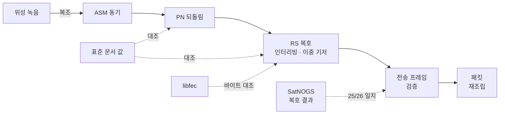

# 🛰️ SpaceLink

CCSDS 다운링크 수신 처리기 (C# / .NET 10) + 신뢰성 시험
위성 비트열 → 전송 프레임 → Space Packet

[](https://github.com/Haejyn/ccsds-downlink-reliability/actions/workflows/ci.yml)


## 요약

- 📡 실제 위성 신호 복호: Astrocast 0.1, EIRSAT-1 녹음
- 🤝 SatNOGS 지상국 복호 결과와 25/26 바이트 일치, SatNOGS 미복호 6장 추가 복원
- 📘 CCSDS 131.0-B-5 표준 값 · libfec 출력과 대조
- ⚡ 수신 체인 ×18.7 (단일 1.34 Gbps · 병렬 1.9 Gbps)
- 🧪 시험 139 · 커버리지 100 % · 뮤테이션 94.65 % · 요구사항 추적 30/30
- 원칙: 손상 가능성이 있는 패킷은 출력하지 않음, 손상과 무관한 패킷은 전부 복구

## 수신 경로



## 실제 신호 복호


<sub>그림 1. Astrocast 0.1 녹음 (9k6 FSK). (a) 파형과 표본 시점, 회색 구간은 ASM (b) 눈 다이어그램</sub>

**Astrocast 0.1**
- CADU 3/3 복호, 송신기 프레임 CRC 일치
- 첫 시도 RS 전부 실패 → 원인: 심볼 속도 9677 baud (공칭 9600 대비 +0.8 %)


<sub>그림 2. EIRSAT-1 패스 188 초 (SatNOGS 관측 12324560, 9k6 GMSK, 인터리빙 4). CADU별 정정 심볼 수</sub>

**EIRSAT-1**
- CADU 46장 중 31장 복원, 정정 심볼 323개
- SatNOGS 지상국 복호 결과와 25/26 바이트 일치
- SatNOGS 미복호 6장 추가 복원 · 확인 근거: 프레임 카운트 공백과 일치, 패킷 88개 연속 조립

## 검증

| 대상 | 기준 | 결과 |
|---|---|---|
| RS 생성 다항식 · 이중 기저 | CCSDS 131.0-B-5 부속서 G · F | 계수 32개 · 256값 일치 |
| PN 수열 (131071 · 255 비트) | 표준 처음 40 비트 | 일치 (첫 구현 오류 발견) |
| RS 부호화 · 복호 | libfec | 35/35 · 25/25 일치 |
| 정정 한계 | 체 이론으로 구성한 오류 패턴 | 16개 정정 · 17개 이상 3,000/3,000 실패 선언 · 오정정 0 |
| 프레임 · 패킷 처리 | 결함 주입 (유실 · 비트 오류 · 중복 · 순서) | 기대 출력 집합과 정확히 일치 |
| 수신 체인 | 실제 위성 신호 · SatNOGS 복호 결과 | CRC 일치 · 25/26 일치 |

## 성능


<sub>그림 3. (a) 최적화 전 CADU 1장 단계별 처리 시간 (b) 수신 체인 처리량, 오류 없음, BenchmarkDotNet</sub>

- 병목: RS 신드롬 (전체의 89 %)
- 개선: 신드롬 32개 동시 계산, PSHUFB 표 곱셈 (SSSE3)
- 결과: 단일 ×18.7, RS 복호 병렬 1.9 Gbps
- 기타: 동기기 바이트 단위 읽기, PN 벡터 XOR, 정정 경로 할당 2,007 → 1,066 B
- 최적화 후 뮤테이션 93.96 %로 하락 → 약점 2개 시험 추가, 동등성 미증명 최적화 2개 되돌림
- CI 게이트는 시간 대신 프레임당 할당

## 찾은 결함

| ID | 내용 | 발견 |
|---|---|---|
| C-1 | 256장 연속 유실 시 카운트 순환 → 손상 패킷 출력 | 결함 주입 시험, PEC로 차단 |
| CH-4 | PN 수열 다항식 오류 (주기 · 역원 성질은 통과) | 표준 처음 40 비트 대조 |
| CH-5 | 짧은 프레임을 뒤쪽 0 채움으로 전송 (표준: 앞쪽 가상 채움, 미전송) | 표준 §4.3.7 대조 |
| 복조 | 실제 녹음 RS 전부 실패 | 심볼 속도 실측 |
| 측정 | 처리량 20~25배 과소 측정 | 병렬 시험 부하 분리, 전용 벤치마크 |

상세: [시험 보고서](docs/test-report.md)

<details>
<summary><b>📊 수치</b></summary>

| 항목 | 값 |
|---|---|
| 시험 | 139 통과 · 빌드 경고 0 |
| 커버리지 | 라인 100 % (786/786) · 분기 99.7 % (329/330) |
| 뮤테이션 | 94.65 % (Stryker.NET) · 생존 전부 판정 · 실제 약점 1개 |
| 요구사항 추적 | 30/30 |
| 처리량 (오류 없음) | 단일 975 ns/프레임 (1.34 Gbps) · 병렬 684 ns (1.9 Gbps) |
| 처리량 (부호어당 오류 8개) | 단일 0.20 Gbps · 병렬 0.72 Gbps |
| 프레임당 할당 | 추출 243 B · 체인 810 B · 정정 경로 1,066 B |

</details>

<details>
<summary><b>⚙️ 실행</b></summary>

```bash
dotnet test tests/SpaceLink.Tests -c Release -p:CollectCoverage=true   # 시험 + 커버리지
python tools/trace.py                                                  # 요구사항 추적
dotnet run -c Release --project benchmarks/SpaceLink.Benchmarks -- --filter '*' --job short
python tools/gen_golden_libfec.py --check                              # libfec 기준 벡터 재현
python tools/gen_golden_capture.py --check                             # 위성 녹음 복조 재현
python tools/make_readme_figures.py                                    # README 그림
```

CI: ubuntu · windows 시험, 커버리지 · 추적 · 재현성 검사, 할당 게이트, 뮤테이션 게이트 (80 %)

</details>

<details>
<summary><b>🗂️ 구성</b></summary>

| 경로 | 내용 |
|---|---|
| `src/SpaceLink/ChannelCoding/` | ASM 동기 · PN · RS · SIMD 신드롬 · 이중 기저 · 채널 코덱 |
| `src/SpaceLink/` | 전송 프레임 · Space Packet · 패킷 재조립 · CRC |
| `tests/SpaceLink.Tests/` | xUnit 139개 · 기준 자료 `golden/` ([출처](tests/SpaceLink.Tests/golden/SOURCES.md)) |
| `benchmarks/` | 추출 단계 · 수신 체인 (단일 · 병렬) |
| `tools/` | 추적 · 할당 게이트 · libfec 벡터 · 녹음 복조 · 그림 · 뮤테이션 루프 |
| `docs/` | [요구사항](docs/requirements.md) · [시험 계획서](docs/test-plan.md) · [시험 보고서](docs/test-report.md) · [추적 매트릭스](docs/traceability.md) |

</details>

## 한계

- 실제 신호: UHF 큐브샛 2기 (9k6), X 밴드 고속 링크 데이터 없음
- 병렬 처리량: 2 Gbps의 96 %, 병목은 순차 패킷 추출
- 오류가 많은 링크: 정정 비용 증가 (병렬 0.72 Gbps)
- 뮤테이션 실제 약점 1개 (동기기 재동기 시작점)
- 범위 밖: 컨볼루션 · 터보 · LDPC, AOS 프레임, 패킷 부헤더

## 관련 프로젝트

[orbit-pass-sim](https://github.com/Haejyn/orbit-pass-sim): 위성 궤도 전파 · 지상국 패스 예측 (Java)
