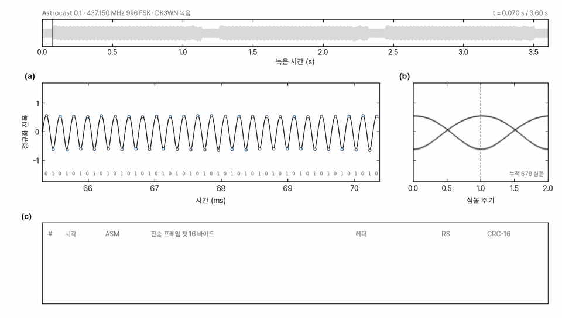
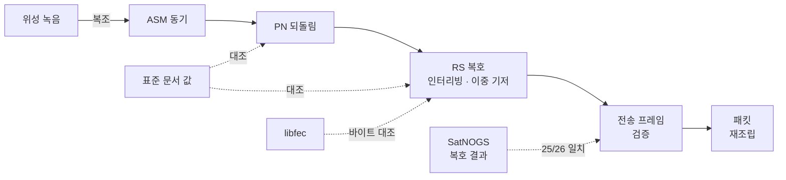
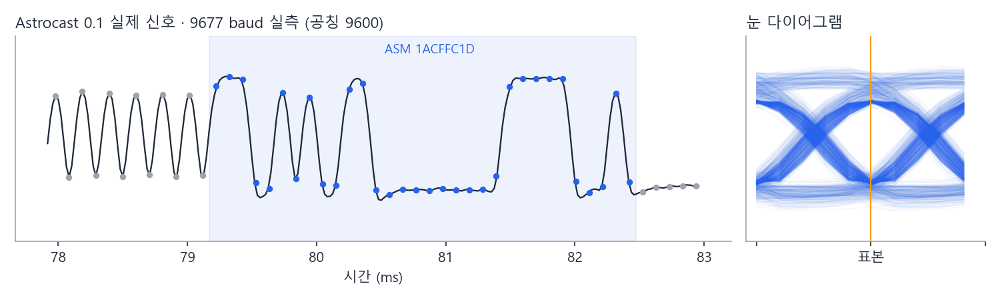
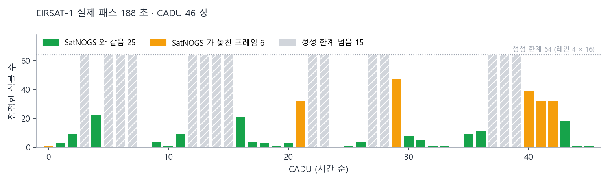
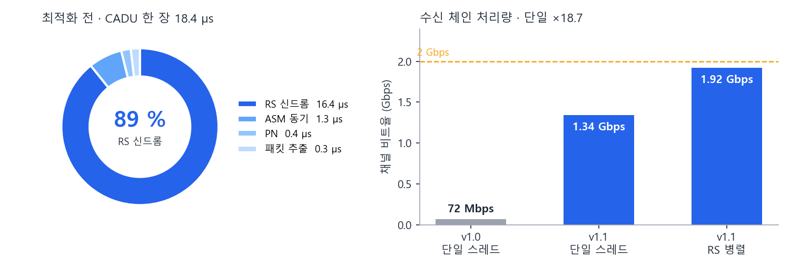

# SpaceLink: CCSDS TM Downlink Receive Chain with Reliability Verification

CCSDS 다운링크 수신 처리기 (C# / .NET 10) 및 신뢰성 시험 — 위성 비트열 → 전송 프레임 → Space Packet

Haejyn · 기술 보고서 · 2026

[](https://github.com/Haejyn/ccsds-downlink-reliability/actions/workflows/ci.yml)



<sub>그림 0. Astrocast 0.1 실제 수신 신호. (a) 파형 · 표본 시점 · ASM (b) 눈 다이어그램 누적 (c) 복호된 프레임. 디코더 출력 그대로이며, 시간 축은 ASM 부근만 확대하였다 ([MP4](docs/media/downlink.mp4)).</sub>

## 1. 범위

본 저장소는 지상국 수신 처리의 첫 단계로서, 위성이 송신한 CCSDS TM 비트열에서 ASM 동기 · PN 역랜덤화 · Reed-Solomon 복호를 거쳐 전송 프레임을 검증하고, 가상 채널별로 Space Packet 을 재조립한다.

설계상의 핵심 요구는 다음과 같다.

> **손상 가능성이 있는 패킷은 출력하지 않는다. 손상과 무관한 패킷은 전부 복구한다.**

**주요 결과**

| 항목 | 결과 |
|---|---|
| 실제 위성 신호 복호 | Astrocast 0.1, EIRSAT-1 녹음 |
| 외부 지상국 대조 | SatNOGS 복호 결과와 25/26 바이트 일치, SatNOGS 미복호 6장 추가 복원 |
| 표준 · 참조 구현 대조 | CCSDS 131.0-B-5 표준 값 · libfec 출력 일치 |
| 처리량 | 수신 체인 ×18.7 (단일 1.34 Gbps · 병렬 1.9 Gbps) |
| 시험 품질 | 시험 139 · 라인 커버리지 100 % · 뮤테이션 94.65 % · 요구사항 추적 30/30 |

## 2. 적용 문서

| 문서 | 제목 | 적용 범위 |
|---|---|---|
| CCSDS 131.0-B-5 | TM Synchronization and Channel Coding | ASM · PN (§10.4.3) · RS 생성 다항식 (부속서 G) · 이중 기저 (부속서 F) · 가상 채움 (§4.3.7) |
| CCSDS 132.0-B | TM Space Data Link Protocol | 전송 프레임 주 헤더 · FECF · 가상 채널 |
| CCSDS 133.0-B-2 | Space Packet Protocol | Space Packet 주 헤더 · 재조립 |

| 내부 문서 | |
|---|---|
| [요구사항 명세](docs/requirements.md) | REQ-ID 별 요구사항과 판정 기준 |
| [시험 계획서](docs/test-plan.md) | 시험 방법 · 기준 자료 |
| [시험 보고서](docs/test-report.md) | 시험 결과 · 결함 상세 |
| [추적 매트릭스](docs/traceability.md) | 요구사항 ↔ 시험 ↔ 결과 |
| [도구 정리](docs/tools.md) | 도구 선정 근거 · 실행 시점 |

## 3. 시스템 개요


```mermaid
flowchart LR
    W["위성 녹음"] -->|복조| A["ASM 동기"]
    A --> P["PN 되돌림"]
    P --> R["RS 복호<br/>인터리빙 · 이중 기저"]
    R --> F["전송 프레임<br/>검증"]
    F --> K["패킷<br/>재조립"]
    S["표준 문서 값"] -. 대조 .-> P
    S -. 대조 .-> R
    L["libfec"] -. 바이트 대조 .-> R
    G["SatNOGS<br/>복호 결과"] -. 25/26 일치 .-> F
```

## 4. 실제 신호 복호

### 4.1 Astrocast 0.1


<sub>그림 1. Astrocast 0.1 녹음 (9k6 FSK). (a) 파형과 표본 시점, 회색 구간은 ASM (b) 눈 다이어그램</sub>

- CADU 3/3 복호, 송신기 프레임 CRC 일치.
- 첫 시도에서 RS 복호가 전부 실패하였다. 원인은 심볼 속도로, 실측 9677 baud (공칭 9600 대비 +0.8 %).

### 4.2 EIRSAT-1


<sub>그림 2. EIRSAT-1 패스 188 초 (SatNOGS 관측 12324560, 9k6 GMSK, 인터리빙 4). CADU 별 정정 심볼 수</sub>

- CADU 46장 중 31장 복원, 정정 심볼 323개.
- SatNOGS 지상국 복호 결과와 25/26 바이트 일치.
- SatNOGS 미복호 6장 추가 복원. 근거: 프레임 카운트 공백과 일치, 패킷 88개 연속 조립.

## 5. 검증

| 대상 | 기준 | 결과 |
|---|---|---|
| RS 생성 다항식 · 이중 기저 | CCSDS 131.0-B-5 부속서 G · F | 계수 32개 · 256값 일치 |
| PN 수열 (131071 · 255 비트) | 표준 처음 40 비트 | 일치 (첫 구현 오류 발견) |
| RS 부호화 · 복호 | libfec | 35/35 · 25/25 일치 |
| 정정 한계 | 체 이론으로 구성한 오류 패턴 | 16개 정정 · 17개 이상 3,000/3,000 실패 선언 · 오정정 0 |
| 프레임 · 패킷 처리 | 결함 주입 (유실 · 비트 오류 · 중복 · 순서) | 기대 출력 집합과 정확히 일치 |
| 수신 체인 | 실제 위성 신호 · SatNOGS 복호 결과 | CRC 일치 · 25/26 일치 |

| 시험 품질 지표 | 값 |
|---|---|
| 시험 | 139 통과 · 빌드 경고 0 |
| 커버리지 | 라인 100 % (786/786) · 분기 99.7 % (329/330) |
| 뮤테이션 | 94.65 % (Stryker.NET) · 생존 전부 판정 · 실제 약점 1개 |
| 요구사항 추적 | 30/30 |

## 6. 성능


<sub>그림 3. (a) 최적화 전 CADU 1장 단계별 처리 시간 (b) 수신 체인 처리량, 오류 없음, BenchmarkDotNet</sub>

| 항목 | 값 |
|---|---|
| 처리량 (오류 없음) | 단일 975 ns/프레임 (1.34 Gbps) · 병렬 684 ns (1.9 Gbps) |
| 처리량 (부호어당 오류 8개) | 단일 0.20 Gbps · 병렬 0.72 Gbps |
| 프레임당 할당 | 추출 243 B · 체인 810 B · 정정 경로 1,066 B |

- 병목: RS 신드롬 (전체의 89 %).
- 개선: 신드롬 32개 동시 계산, PSHUFB 표 곱셈 (SSSE3). 단일 ×18.7, RS 복호 병렬 1.9 Gbps.
- 기타: 동기기 바이트 단위 읽기, PN 벡터 XOR, 정정 경로 할당 2,007 → 1,066 B.
- 최적화 후 뮤테이션이 93.96 %로 하락하여, 약점 2개에 시험을 추가하고 동등성이 증명되지 않은 최적화 2개를 되돌렸다.
- CI 게이트는 실행 시간 대신 프레임당 할당으로 판정한다.

## 7. 결함 보고

| ID | 내용 | 발견 경로 |
|---|---|---|
| C-1 | 256장 연속 유실 시 카운트 순환 → 손상 패킷 출력 | 결함 주입 시험, PEC 로 차단 |
| CH-4 | PN 수열 다항식 오류 (주기 · 역원 성질은 통과) | 표준 처음 40 비트 대조 |
| CH-5 | 짧은 프레임을 뒤쪽 0 채움으로 전송 (표준: 앞쪽 가상 채움, 미전송) | 표준 §4.3.7 대조 |
| 복조 | 실제 녹음 RS 전부 실패 | 심볼 속도 실측 |
| 측정 | 처리량 20~25배 과소 측정 | 병렬 시험 부하 분리, 전용 벤치마크 |

상세는 [시험 보고서](docs/test-report.md) 참조.

## 8. 한계

- 실제 신호: UHF 큐브샛 2기 (9k6). X 밴드 고속 링크 데이터 없음.
- 병렬 처리량: 2 Gbps 의 96 %. 병목은 순차 패킷 추출.
- 오류가 많은 링크: 정정 비용 증가 (병렬 0.72 Gbps).
- 뮤테이션 실제 약점 1개 (동기기 재동기 시작점).
- 범위 밖: 컨볼루션 · 터보 · LDPC 부호, AOS 프레임, 패킷 부헤더.

## 9. 빌드 및 시험

```bash
dotnet test tests/SpaceLink.Tests -c Release -p:CollectCoverage=true   # 시험 + 커버리지
python tools/trace.py                                                  # 요구사항 추적
dotnet run -c Release --project benchmarks/SpaceLink.Benchmarks -- --filter '*' --job short
python tools/gen_golden_libfec.py --check                              # libfec 기준 벡터 재현
python tools/gen_golden_capture.py --check                             # 위성 녹음 복조 재현
python tools/make_readme_figures.py                                    # README 그림
python scripts/make_downlink_animation.py                              # README 애니메이션 (tools/DownlinkTrace 출력 사용)
```

CI (GitHub Actions): ubuntu · windows 시험, 커버리지 · 추적 · 재현성 검사, 할당 게이트, 뮤테이션 게이트 (80 %).

| 용도 | 도구 |
|---|---|
| 시험 | xUnit · .NET 분석기 (경고 = 오류) |
| 품질 측정 | coverlet (커버리지) · Stryker.NET (뮤테이션) |
| 기준 자료 | CCSDS 표준 문서 · libfec · 위성 녹음 · SatNOGS 복호 결과 |
| 성능 | BenchmarkDotNet · 프레임당 할당 게이트 |
| 추적 | `tools/trace.py` → 추적 매트릭스 |

## 10. 저장소 구성

| 경로 | 내용 |
|---|---|
| `src/SpaceLink/ChannelCoding/` | ASM 동기 · PN · RS · SIMD 신드롬 · 이중 기저 · 채널 코덱 |
| `src/SpaceLink/` | 전송 프레임 · Space Packet · 패킷 재조립 · CRC |
| `tests/SpaceLink.Tests/` | xUnit 139개 · 기준 자료 `golden/` ([출처](tests/SpaceLink.Tests/golden/SOURCES.md)) |
| `benchmarks/` | 추출 단계 · 수신 체인 (단일 · 병렬) |
| `tools/` | 추적 · 할당 게이트 · libfec 벡터 · 녹음 복조 · 그림 · 뮤테이션 루프 |
| `docs/` | 요구사항 · 시험 계획서 · 시험 보고서 · 추적 매트릭스 · 도구 정리 |

## 관련 저장소

- [orbit-pass-sim](https://github.com/Haejyn/orbit-pass-sim) — 위성 궤도 전파 · 지상국 패스 예측 (Java)

## Citation

```bibtex
@misc{haejyn2026spacelink,
  author       = {Haejyn},
  title        = {SpaceLink: CCSDS TM Downlink Receive Chain with Reliability Verification},
  year         = {2026},
  howpublished = {\url{https://github.com/Haejyn/ccsds-downlink-reliability}}
}
```

## License

- 코드: [MIT](LICENSE)
- 시험 자료 (`tests/SpaceLink.Tests/golden/`): 원 라이선스 유지 ([출처](tests/SpaceLink.Tests/golden/SOURCES.md))
  - `eirsat1_*`: CC BY-SA 4.0 (SatNOGS)
  - `astrocast_9k6_bits.bin`: Unlicense (satellite-recordings)
  - `libfec_rs_vectors.txt`: libfec 출력 데이터 (libfec 코드 미포함)
