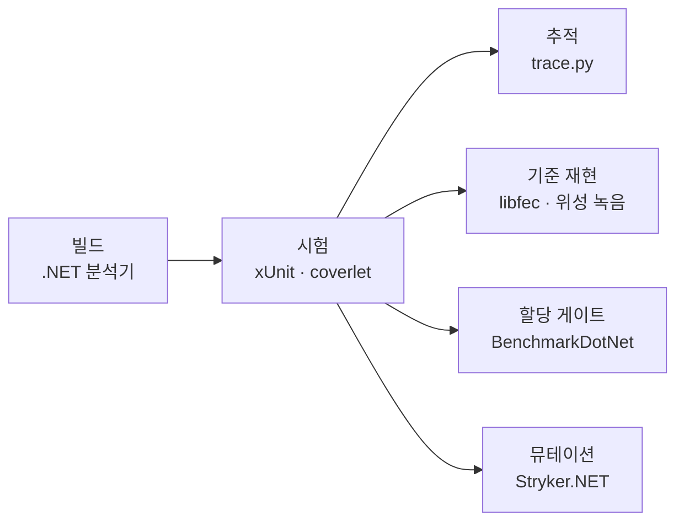

# 도구 정리

이 저장소에서 쓰는 도구 · 하는 일 · 고른 이유 · 도는 시점

- 🖥️ 로컬 = 개발자가 직접 실행
- ☁️ CI = GitHub Actions (`.github/workflows/ci.yml`), push · PR 마다

## 한눈에

## 시험 실행

| 도구 | 하는 일 | 왜 이것 | 언제 |
|---|---|---|---|
| **xUnit** 2.9 | 시험 139개 실행, `[Trait("Requirement", …)]` 로 요구사항 표시 | .NET 표준 시험 러너, `[Theory]` 로 경계값 · 오류 개수 등 매개변수 시험이 간단 | 🖥️ `dotnet test` · ☁️ ubuntu · windows 매 push |
| **.NET 분석기** (latest-recommended) | 빌드 시 코드 규칙 검사 | 별도 도구 없이 컴파일러에 붙는 정적 분석, `TreatWarningsAsErrors` 로 경고 0 을 게이트로 | 🖥️ ☁️ 모든 빌드 |

## 품질 측정

| 도구 | 하는 일 | 왜 이것 | 언제 |
|---|---|---|---|
| **coverlet** 6.0 | 라인 · 분기 커버리지, 기준 미달 시 실패 (라인 90 % · 분기 85 %) | `dotnet test` 에 옵션만 붙이면 되는 MSBuild 통합 | ☁️ 시험 단계 (Cobertura 보고서 업로드) |
| **Stryker.NET** | 코드를 일부러 바꾼 뮤턴트를 만들어 시험이 잡는지 측정, 80 % 미만 실패 | 커버리지는 "실행됐다" 만 보여 줌 → "틀리면 잡는가" 를 재는 도구가 필요 | ☁️ 별도 잡 (40~75분) · 🖥️ 특정 파일만 `--mutate` |
| `tools/mutation_loop/` | 생존 뮤턴트 → 모델이 시험 초안 작성 → 생존이 줄 때만 채택 | AI 가 쓴 시험을 사람 판단이 아니라 뮤테이션 점수로 거름 | 🖥️ 수동 실행만 (CI 제외, 모델 호출) |

## 정답 기준 (구현 밖에서 가져온 기대값)

| 도구 | 하는 일 | 왜 이것 | 언제 |
|---|---|---|---|
| **CCSDS 표준 문서** 131.0-B-5 (값 대조) · 132.0-B · 133.0-B (프레임 · 패킷 구조) | RS 생성 다항식 계수 · 이중 기저 행렬 · PN 처음 40 비트를 시험에 값으로 고정 | 성질 시험(주기 · 역원)은 틀린 다항식도 통과함 → 표준 값이 기준 | 시험 코드에 상수로 (문서는 저장소 밖) |
| **libfec** (Phil Karn) + `tools/gen_golden_libfec.py` | 고정 커밋을 C 로 빌드해 RS 부호화 · 복호 기준 벡터 생성 | 지상국 소프트웨어에서 널리 쓰는 독립 구현 → 표준 오독까지 잡힘 | 🖥️ RS 변경 시 재생성 · ☁️ ubuntu `--check` (gcc) |
| `tools/gen_golden_capture.py` | 위성 녹음(Astrocast 0.1 WAV · EIRSAT-1 OGG)을 받아 sha256 확인 → 복조 → 비트열 고정 자료 | 실제 송신기 출력이 최종 기준, 녹음 대신 복조 결과만 저장 | 🖥️ 복조 변경 시 · ☁️ ubuntu `--check` (numpy · soundfile) |
| **SatNOGS** 관측 12324560 | 같은 녹음을 그 지상국이 복호한 프레임 26장 | CRC 없는 프레임의 독립 기준 | 위 도구가 API 로 받아 고정 |

## 성능

| 도구 | 하는 일 | 왜 이것 | 언제 |
|---|---|---|---|
| **BenchmarkDotNet** 0.15 | 추출 단계 · 수신 체인(단일 · 병렬) 시간과 프레임당 할당 측정 | 워밍업 · 반복 · 통계 처리 내장. xUnit 안에서 재던 방식은 병렬 시험 부하로 20~25배 틀렸음 | 🖥️ 성능 변경 전후 (조용한 기계, 같은 조건 연달아) · ☁️ 할당만 |
| `tools/check_allocation.py` | 벤치마크별 프레임당 할당 예산 초과 시 실패, 예산 없는 벤치마크도 실패 | 공유 러너는 시간 편차가 커서 시간 게이트는 거짓 실패 → 할당은 결정적 | ☁️ 벤치마크 잡 |
| 단계별 Stopwatch 하네스 | 동기 · PN · RS 단계 시간 분리 측정 | 병목 위치 확인용 일회성 측정 (저장소 밖) | 🖥️ 최적화 전 |

## 추적 · 보고

| 도구 | 하는 일 | 왜 이것 | 언제 |
|---|---|---|---|
| `tools/trace.py` | `requirements.md` ↔ 시험 `[Trait]` ↔ TRX 결과 대조 → `traceability.md` 생성 | 요구사항마다 시험 존재 · 통과를 자동 확인, 누락 · 오타 ID 는 실패 | ☁️ 시험 직후 · 🖥️ 요구사항 추가 시 |
| `docs/` 문서 4종 | 요구사항 · 시험 계획 · 시험 보고 · 추적 매트릭스 | 개발 체계(요구사항 → 설계 → 시험 → 보고) 산출물 | 변경마다 갱신 |

## 자동화

| 도구 | 하는 일 | 언제 |
|---|---|---|
| **GitHub Actions** | ubuntu · windows 매트릭스로 빌드 · 시험 · 커버리지 · 추적 · 기준 재현, 할당 게이트 잡, 뮤테이션 잡 | push · PR 마다, 뮤테이션은 시험 잡 통과 후 |

## 보조

| 도구 | 하는 일 | 언제 |
|---|---|---|
| `tools/make_readme_figures.py` (matplotlib · Pretendard) | README 그림 3장 생성 | 🖥️ 수치 · 자료 변경 시 |
| `tools/CaptureReport` | EIRSAT-1 고정 자료를 수신 체인으로 복호해 CADU별 결과 CSV 출력 | 그림 생성 시 자동 |
| **LLVM-MinGW** (clang) | 로컬에서 libfec 빌드 | 🖥️ 기준 벡터 재생성 시 |

## 고르지 않은 것 · 이유

- 시간 기준 성능 게이트 → 러너 편차로 거짓 실패, 할당 게이트로 대체
- xUnit 안의 처리량 측정 → 병렬 시험 부하가 섞임, 회귀 하한(5,000 프레임/초)으로만 남김
- 뮤테이션 루프의 CI 실행 → 모델 반복 호출, 사람이 실행할 때만
- libfec 저장소 포함 → LGPL, 하네스와 출력 벡터만 포함
- 위성 녹음 원본 포함 → 용량 · 라이선스, 고정 URL + sha256 으로 받아 복조 결과만 포함
